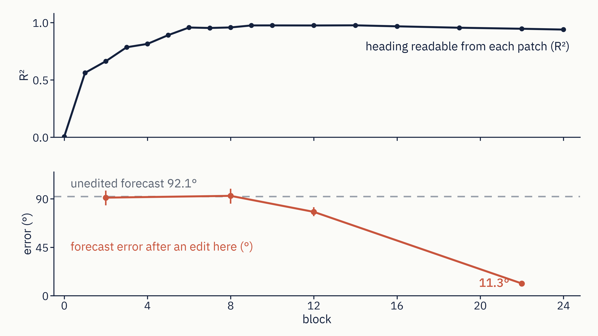
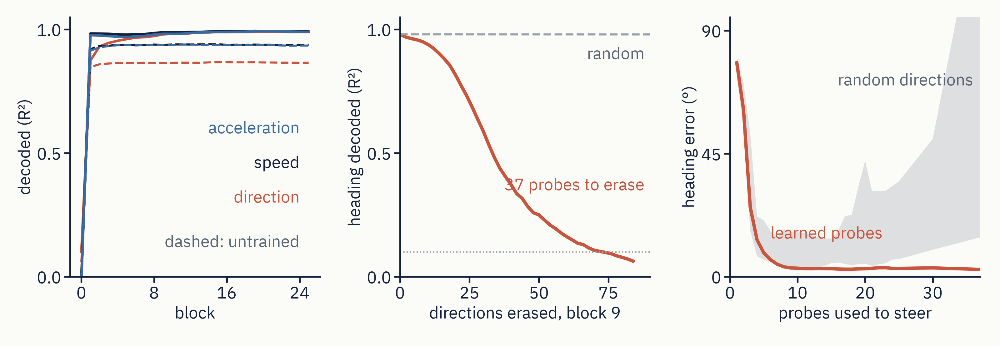

# Reading and steering motion in V-JEPA 2

Layer-wise probing, nullspace erasure and steering of physical variables (direction, speed, acceleration) in the
frozen V-JEPA 2 ViT-L/16 encoder, judged by the model's own predictor. Part 1 repeats the probing, nullspace and
multi-probe steering experiments of Joseph et al. (2026). Part 2 builds spline (manifold) edits after Wurgaft et al.
(2026) and asks whether the predictor consumes the code at values the spline never saw.

**Short version: readable is not used.** Direction is decodable from every patch by block 6, but a frame-wide edit at
block 12 is mostly undone before the predictor sees it. A late edit, or an edit on the object's own tokens, reaches the
forecast. Curved edits keep the heading on the way; straight edits land as close at the endpoint.

<p align="center"></p>

- Full write-up with every number and its source file: [REPORT.md](REPORT.md)
- 15-minute talk (29 slides, speaker notes): https://claude.ai/artifact/JdPJ1Yig3LpL5KntZCJo88
- Every reported number is in `results/*.json`; the talk's numbers are indexed in [talk/slides_v2/NUMBERS.md](talk/slides_v2/NUMBERS.md)

## Getting started

Python 3.11. A 16 GB GPU is needed for activation extraction (about 40 minutes for all six runs on an RTX 4080 SUPER)
and for the predictor tests (about 20 minutes each on an RTX 4060 Ti). Everything else runs on CPU.

```bash
git clone https://github.com/stevenybuilder/jepa_physics && cd jepa_physics
python3.11 -m venv .venv && source .venv/bin/activate
pip install -e .                         # pinned in pyproject.toml: torch 2.2.2, transformers 4.56.2 (facebook/vjepa2-vitl-fpc64-256 downloads on first use)
python -m pytest -q                      # unit tests, CPU, a few minutes
```

Place the supplied take-home data at `vjepa-physics-takehome-4E00/data/` (the three `manifest.jsonl` files and
`videos/`). The code only reads it. Derived files go to `artifacts/` (activations, git-ignored), `results/` (JSON)
and `figures/`. The bake-off arms that use the Goodfire authors' spline code expect their repository at
`refs/causalab` (`git clone https://github.com/goodfire-ai/causalab refs/causalab`, commit `1b6f43a`).

## Reproduce

Each step reads the previous step's outputs from disk, so any step can be rerun alone.

```bash
# 0. Activations: mean-pooled tokens at all 26 read points, per dataset (GPU)
for d in direction speed acceleration; do
  for m in vjepa2 random; do                                       # trained encoder and an untrained copy
    python scripts/extract.py run   --dataset $d --model $m --batch-size 16
    python scripts/extract.py merge --dataset $d --model $m
  done
done
python scripts/run_qa.py                                           # checks every clip decodes -> results/qa_*.json
python scripts/make_splits.py                                      # one stratified 80/20 split -> splits/split_v1.json

# 1. Part 1: layer-wise probes, iterative nullspace, multi-probe steering (CPU)
for d in direction speed acceleration; do
  python scripts/run_step1.py --dataset $d                          # trained encoder
  python scripts/run_step1.py --dataset $d --model random           # untrained control
  python scripts/run_step1.py --dataset $d --shuffled               # shuffled-label control
done
# per-patch probes, the harder render and the untrained seeds: p1a_perpatch.py extract/probe/seeds and
# render_hard_stimuli.py (GPU); exact invocations in scripts/README.md
python scripts/run_step2.py --dataset direction --layer-role paper                 # INLP at the paper's layer
python scripts/run_step3.py --dataset direction --layer-role paper                 # steering on held-out clips vs random-basis nulls

# 2. Part 2: splines, lines and the ring on held-out contiguous arcs (CPU)
python scripts/run_part2.py --dataset direction --layer 12 --holdout contiguous --spline smooth
python scripts/run_part2.py --dataset direction --layer 22 --holdout contiguous --spline smooth
python scripts/run_bakeoff.py --dataset speed        --layer 19 --spline smooth   # lines: spline vs chord
python scripts/run_bakeoff.py --dataset acceleration --layer 21 --spline smooth
for L in 12 22; do                                                   # six edits on 16 seeds, then the table
  python scripts/run_bakeoff_unified_16arc.py --layer $L --seeds 0 1 2 3 4 5 6 7   --out results/endpoint_diagnosis_raw/unified_L${L}_a.json
  python scripts/run_bakeoff_unified_16arc.py --layer $L --seeds 8 9 10 11 12 13 14 15 --out results/endpoint_diagnosis_raw/unified_L${L}_b.json
done
python scripts/aggregate_bakeoff_unified_16arc.py                    # -> results/p2_bakeoff_unified_16arc.json

# 3. Through the predictor: edit at a block, run V-JEPA 2's predictor, read the forecast (GPU)
python scripts/run_session2.py plan && python scripts/run_session2.py forward --batch-size 16 && python scripts/run_session2.py score
python scripts/session2_native_readout.py extract && python scripts/session2_native_readout.py score   # forecast heading: 11.3° / 27.2° / 92.1°
python scripts/run_position_predictor.py plan && python scripts/run_position_predictor.py forward --batch-size 16 && python scripts/run_position_predictor.py score   # start-position edit through the predictor
python scripts/run_token_patching.py plan && python scripts/run_token_patching.py forward && python scripts/run_token_patching.py score   # which tokens carry the code

# 4. Figures
python scripts/make_figures.py            # report figures -> figures/
python talk/make_talk_figs_v2.py         # talk figures -> talk/figures_v2/ (the two shown here)
```

`scripts/README.md` lists every script with what it produces and the REPORT section it feeds: the harder render
(`render_hard_stimuli.py`), the paper's Adam probe recipe (`run_step3_adam_basis.py`, `run_step3_adam_judge.py`),
the acceleration grid, model size and attention heads.

## Findings

**Part 1: the paper's picture reproduces in part.** Direction, speed and acceleration are readable from block 1 in the
pooled readout (direction R² 0.875, and 0.848 from an untrained copy of the encoder), so the Physics Emergence Zone
does not show on the supplied clips, where every clip starts at rest and acceleration equals mean speed. On a harder
render the zone appears as a handover: a code that transfers across the frame at block 1 stops transferring by block 8
and returns by block 22, and the untrained copy never transfers at block 1. At block 9, 37 ridge probes erase direction
under nested cross-validation (46 scored on test, 84 to 96 with the paper's Adam recipe, one after whitening). Five
ridge probes steer to 8.7° on held-out clips; with the paper's Adam probes the count is 11 to 19, near its about 20.

<p align="center"></p>

**Part 2: speed and acceleration are lines, direction is a ring.** Splines add nothing on a line. On the ring, at
held-out endpoints (16 seeds over 15 arcs) the straight chord lands as close as the curves at block 22, within 0.8° to
2.3° (only an exploratory knot-cross-validated smoother edges it, by 0.4°), and at block 12 the paper's interpolating
spline overshoots the ring (34.5° against the chord's 6.7°). These are additive edits; under the paper's replacement
rule the chord's lead is larger (1.6° against 4.8° at block 22). What the curves buy is the path: at their own size they
keep the readout on the ring (radius at least 0.80, and 0.71 at the chord's size) where the chord drops to 0.59 to 0.61.

**The predictor decides.** A frame-wide edit at block 12 is repaired (forecast 79.7° from target against 92.1°
unedited); the same edit on the disk's tokens reaches it (44.7°). At block 22 the spline's forecast heading lands 11.3°
from target and the chord's 27.2°. Token patching shows the forecast reads direction from the disk through block 12
(0.88 of the effect) and from the whole frame by block 22 (0.22 from the disk). Position behaves the same way: a
start-position edit at block 22 closes 0.35 of the gap to the target cell in the forecast (a real twin 0.78), an edit at
block 12 closes 0.01 and reads R 0.009 at the encoder's exit; sheet and chord land within a pixel of each other (48
carriers, 2 targets each from 4 held-out cells; no paired test).

**Controls and negatives.** A "contact" edit writes a post-contact heading, not a contact (a no-wall heading edit turns
the forecast more, 0.77 against 0.48). The within-clip time code tracks the token slot, not the content, and
pushing it moves the forecast's disk sideways rather than forward in time. Conceptor steering and energy geodesics add nothing over the chord. Without the heading probe the
chord moves the whole forecast further at matched size (recovery 0.234 against 0.186).

**Limitations.** One stimulus family, one render, one frame rate. The predictor results read a heading code with a
probe, not a rendered future. Some follow-ups use 48 to 200 carriers or one arc; REPORT §7 lists each.

## Repository layout

```
src/wm/        library: extraction, splits, probes, INLP, steering, splines, predictor readout
scripts/       one entry point per experiment (scripts/README.md is the index)
tests/         pytest suite
splits/        the train/test split used everywhere
results/       every number as JSON, with a provenance block (split hash, commit)
figures/       plots for the report; talk/figures_v2/ for the talk
talk/          deck sources (deck_v2.json, slides_v2/*.html) and NUMBERS.md
REPORT.md      the full write-up
```

## References

- Joseph et al., *Interpreting Physics in Video World Models*, arXiv:2602.07050, 2026.
- Wurgaft et al. (Goodfire), manifold (spline) steering, arXiv:2605.05115, 2026.
- Assran et al., *V-JEPA 2*, 2025. Weights via Hugging Face `facebook/vjepa2-vitl-fpc64-256`.
